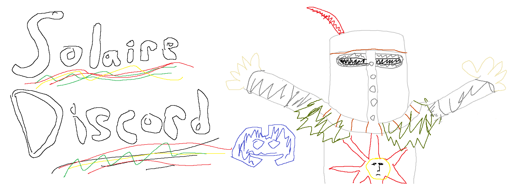

# Solaire

[](https://badge.fury.io/js/solaire-discord)

A lightweight framework with a simple interface for creating Discord bots in Node

```js
import Discord from 'discord.js';
import { Solaire } from "solaire-discord";

const client = new Discord.Client({
  intents: [ Discord.Intents.FLAGS.GUILDS, Discord.Intents.FLAGS.GUILD_MESSAGES ]
});

const bot = Solaire.create({
  discordClient: client,
  token: process.env.TOKEN,
  commandPrelude: "!",
  commands: {
    // In a Discord channel...
    // > !ban @someUser being mean
    "ban <user:GuildMember> <...reason>": {
      execute({ args, message }) {
        // args.user: Discord.js::GuildMember(someUser)
        // args.offense: ["being", "mean"]
        message.channel.send(`Banning ${args.user.displayName} for ${args.reason.join(' ')}!`;
      },
    },
  },
});

bot.start();

```

### Discord.js
Solaire interacts heavily with [Discord.js](https://github.com/discordjs/discord.js), and many of the objects exposed from the Solaire API will be directly from Discord.js.

**Solaire requires that you provide a Discord.js client version >=13.0.0**

### 📣 Simplicity & Limitations 📣
Solaire is very much targetted at developers working on smaller or simpler Discord bots that don't require some of the more advanced features of existing popular Discord bot frameworks, and just want something that will get their bot up and running quickly. More advanced features may be added in the future, but the guiding principle of the framework will always be simplicity in its API. 

If you don't find Solaire's feature-set to be advanced enough for your use case, there are other great Discord/Node frameworks to take a look at 
- [sapphire](https://github.com/sapphiredev/framework)
- [discord-akairo](https://github.com/discord-akairo/discord-akairo)

#### Slash Commands
Solaire does **not** utilize the new Discord [slash commands feature](https://blog.discord.com/slash-commands-are-here-8db0a385d9e6), instead utilizing the old-fashioned method of listening to new message events.

---

**[Example Bot](./example-bot)**

[Install](#install) ·
[Example Config](#example-config) ·
[Defining Commands](#defining-commands) ·
[Command Configuration](#command-configuration) ·
[Events](#events)

---

## Install
`npm install solaire-discord`

## Config

| Property          | Required | Type                                   | Desc                                                                                                                                                                         |
|-------------------|----------|----------------------------------------|------------------------------------------------------------------------------------------------------------------------------------------------------------------------------|
| `discordClient`   | Yes      | `Discord.js::Client`                   | A Discord.js Client object. This client must have the `GUILD_MESSAGES`  intent enabled for Solaire to work properly.                                                         |
| `token`           | Yes      | `string`                               | Your bot's Discord token (see https://discord.com/developers/docs/intro)                                                                                                      |
| `commandPrelude`  | No       | `string`                               | The string that must precede a command's name in a Discord message for  the command to be invoked. Common values are `!`, `?`, `;;`, but any  string would technically work. |
| `commandCooldown` | No       | `number`                               | The amount of time in milliseconds that a command is un-invokable after being used. This cooldown is _per-command_.                                                          |
| `commands`        | Yes      | `Record<string, CommandConfiguration>` | See [Defining commands](#defining-commands) and [Command configuration](#command-configuration)                                                                                                                            |

## Defining commands
In Solaire, bot commands are defined using a definition string that resembles how you would actually use the command in Discord. For example, a command that is used like `!ban @someAnnoyingUser being mean`, would be defined using the string `ban <user:GuildMember> [...reason]`.

This string, along with associated configuration for the command, is passed in via your Solaire config's `commands` property.

```js
   const bot = Solaire.create({
    ...
    commands: {
      'ban <user:GuildMember> <...reason>': {
        ...
      }
    }
  })
```

### Command Name & Aliases
A command's name is defined as the first word in your command definition string
```
ban <user>
^------ "ban" is the command's name
```

You can define aliases for a command by appending the command's name with `|<alias>`, e.g.
```
ban|b|banMember <user>
^---- "ban is the command's name, but "b" and "banMember" can also be used to invoke the command
```


### Command Arguments
After your command's name, you can define any number of arguments that can be passed into your command. 

**Required Arguments**

Required arguments are denoted in the definition string by being wrapped in `<>`, e.g.
```
ban <user>
      ^---- "user" is a required argument for the "ban" command
```

**Optional Arguments**

Optional arguments are denoted by being wrapped in `[]`, e.g.
```
ban <user> [reason]
             ^---- "reason" is an optional argument
```

When an optional argument is defined, the remaining arguments in the command must also be optional.

```
ban [reason> <user>
               ^----- INVALID - since "reason" is optional, all arguments after it must also be optional           
```

**Rest Arguments**

A "rest" argument is an arg whose value is defined as all remaining words in a message. They are denoted by the arg's name being preceded with `...`. e.g.

```
ban <user> [reason]
> !ban @someAnnoyingUser being mean
                          ^----- "reason" arg has value "being"
                          
ban <user> [...reason]
> !ban @someAnnoyingUser being mean
                          ^----- "reason" arg has value "being mean"
```

A rest argument must be the last argument of a command. When accessing the argument in your execute, guard, etc. functions, the value of the argument will be an array.

#### Argument Types

An argument's value can be constrained by defining an explicit `type` for that argument, denoted in the command definition string by appending the argument's name with `:<argType>`, e.g.

```
ban <user:GuildMember>
           ^---- "user" arg value must be parseable into a "GuildMember" type
```

Defining an argument type has a few benefits

- It validates that the passed in value is valid
- It automatically parses the argument and fits it to its type, transforming the value to a more convenient data type for use when processing and executing the command
- It provides documentation for how our command is supposed to be used

The available argument types are:

| Argument Type | Validation                                                               | Resolved JS Type          |
|---------------|--------------------------------------------------------------------------|---------------------------|
| Int           | Validates using `parseInt`                                               | `Number`                  |
| Float         | Validates using `parseFloat`                                             | `Number`                  |
| GuildMember   | Validates that ID passed in resolves to a member of the message's server | `Discord.js::GuildMember` |
| Date          | Validates using `new Date()`                                             | `Date`


## Command Configuration
### Command Execute Function
When your command is invoked, the command's `execute` function gets called.

```js
   const bot = Solaire.create({
    ...
    commandPrelude: '!',
    commands: {
      'ban <user:GuildMember> [...reason]': {
        async execute({ args, message }) {
         // message: Discord.js::Message
         // args.user: Discord.js::GuildMember
         // args.reason: string[]
         
         const fullReason = args.reason.join(' ');

         message.channel.send(`Banning ${args.user.displayName} for ${fullReason}`;

         user.ban({ reason: fullReason })
        }
      }
    }
  })
```

```
> !ban @someAnnoyingUser mean
< Banning Some Annoying User for mean
```

The payload that gets passed into the `execute` function contains the following properties

| Property  | Type                  | Desc                                   |
|-----------|-----------------------|----------------------------------------|
| `args`    | `Record<string, any>` | The arguments passed into the command  |
| `message` | `Discord.js::Message` | The message that triggered the command |


### Command Authorization

You can restrict which users can invoke a command by defining a `guard` function for a command. 

```js
   const bot = Solaire.create({
    ...
    commandPrelude: '!',
    commands: {
      'ban <user:GuildMember> [...reason]': {
        async execute({ args, message }) {...},
        async guard({ error, ok, message, args}) {
          if(!message.member.roles.cache.some(r => r.name.toLowerCase() === 'admin'){
            error('Member must be an admin');
          } else {
            ok();
          }
        }
      }
    }
  })
```
The payload provided to the `guard` function is the same as the one given to the `execute` function, with the addition of two new callback properties `ok` and `error`. If a `guard` function is provided, the command will be exected **only if** `guard` calls the `ok` function, **and** the `error` function is **not** called. If neither is called, the command will default closed and not execute.

### Command Prelude
It is heavily suggested that you assign a `commandPrelude` to your bot, which is the string that is required at the start of any command invocation. Otherwise, Solaire has to process every single message for the possibility that it's invoking a command. It's also just nan extremely common practice for chat bots.

```js
   const bot = Solaire.create({
    ...
    // To invoke a command in chat, the message has to start with '!'
    // e.g. ❌  ban @someUser being mean WON'T work
    //      ✅ !ban @someUser being mean WILL work
    commandPrelude: '!',
    commands: {
      'ban <user> <reason>': {
        ...
      }
    }
   })
```

```
> !ban @someAnnoyingUser mean
```


```
> !ban @someAnnoyingUser being mean
< Banning Some Annoying User for being mean
```

## Events

The Solaire class extends `EventEmitter`, and emits events that you can listen to. 

### `commandInvokedEnd`

This event gets emitted after a bot command is invoked and Solaire has finished processing the invocation. The object that is passed to the listener has the following properties

| Property  | Type                     | Desc                                              |
|-----------|--------------------------|---------------------------------------------------|
| `success` | `boolean`                | Whether or not the command executed successfully  |
| `command` | `Command`                | The Command that was invoked                      |
| `message` | `Discord.js::Message`    | The message that invoked the command              |
| `error`   | `CommandInvocationError` | See [`command-invocation-error.ts`](./src/command-invocation-error.ts) for all possible values  |
